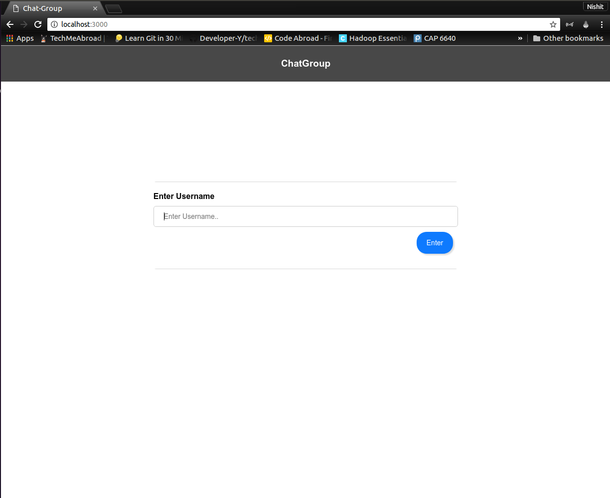
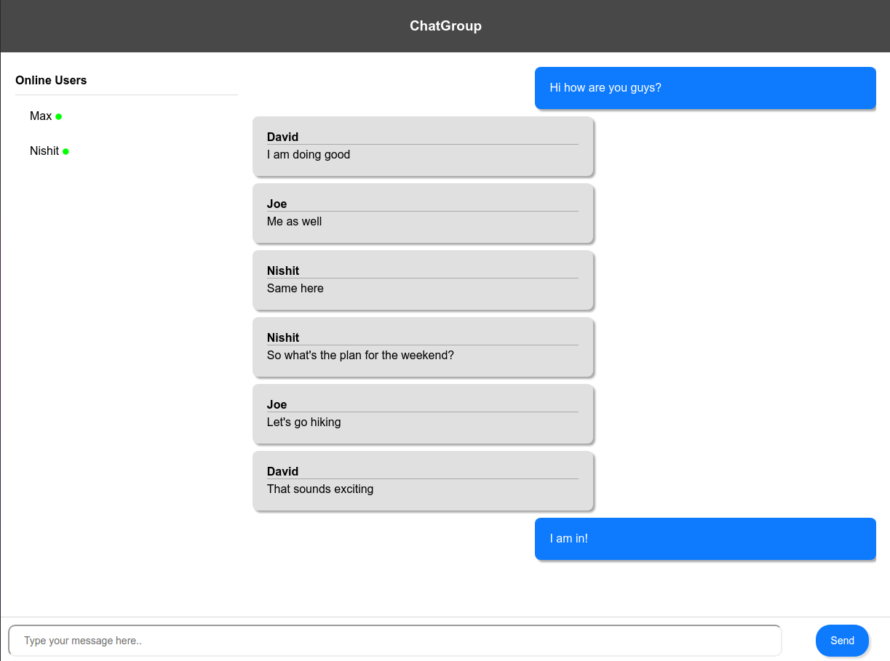
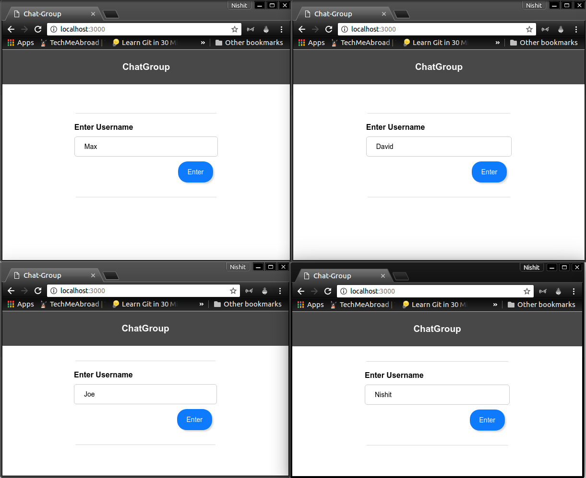
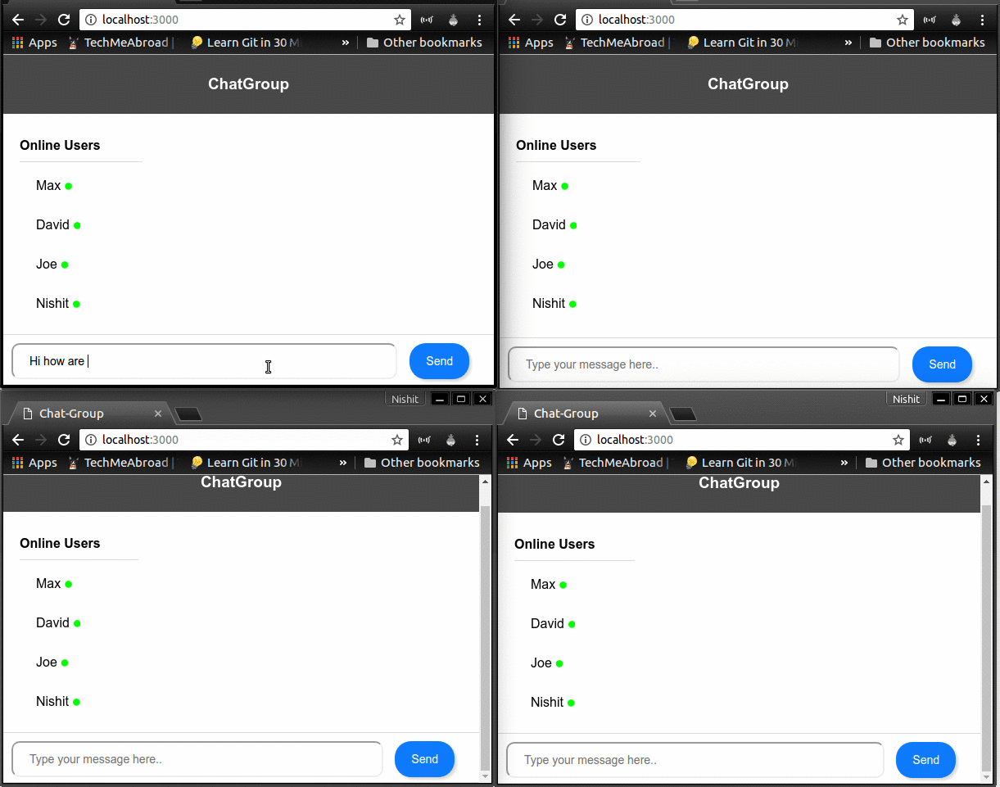

# ChatGroup
---
Web application with the aim to improve interaction in group conversations

### Introduction

There are so many available chatroom web applications available. Each of them provides a platform to make group conversations feasible.

Apple’s UI experience is great. With few grayscales, blue and white color, it generates such great interfaces in beautiful way (with great attention to detail) not limited to content, animations, etc. The great part about Apple is this great experience that focuses on ease of usage by customers is present everywhere such as iPhone, Macs, iPads, Website etc.

Inspired and motivated with such great design, I have started developing a typical chat room for group conversations to enhance multiple users' interactivity with the look and feel almost like Apple design.

### My Approach

The web application is in beta version (as this is just a start). Currently, it has two simple user interfaces, namely:

- **Username interface**: End user provides a username and enters the chatroom
- **Chatroom body interface**: The chatroom body where the group conversation happens and where it shows the total number of users online.

The following languages and technologies were used in setting up this project currently:

**Front-end**: `HTML`, `CSS` and `jQuery`.
**Server setup**: `Node.js`, `Express` and `Socket.io`

The current implementation is done in a localhost server (port number 3000 considered).

Each user acts as a socket for communication. The socket acts as a client interface for communication with the server. Each client (or socket) sends message to the node.js server and the custom server script processes the data received and broadcasts to all active clients.

CSS is used along with jQuery script to separate own messages with received messages.
Blue color (with certain HEX code) is used for sending messages from a user's end and custom gray color (with certain HEX code) is used for receiving broadcasted messages.

The following are some screenshots that showcase the interface (tested in localhost):
1.	Username interface:
 

2.	Chatroom body interface:
 

3.	Example of 4 people entering their respective usernames:
 

4. The following gif that shows a normal group conversation between Max, David, Joe and Nishit:
 

### Future Work

The following are the enhancements that I am currently planning to implement:

- Include **whisper** concept, which means that a user can privately send message to someone within a group conversation room. He/She must use a certain keyword such as '\w', followed by the receiver's name.

- Providing **clipboard** menu to track the recent copied text the user has done during the conversation. In this case, a *stack data structure* will be used as the most recent copied element(pushed) should be accessible first (popped).

- Include smileys for displaying certain expressions.
